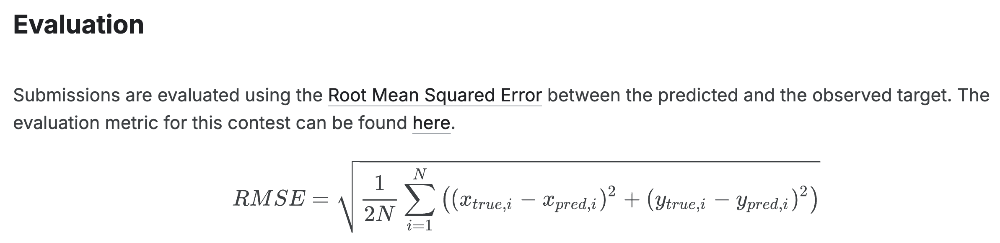
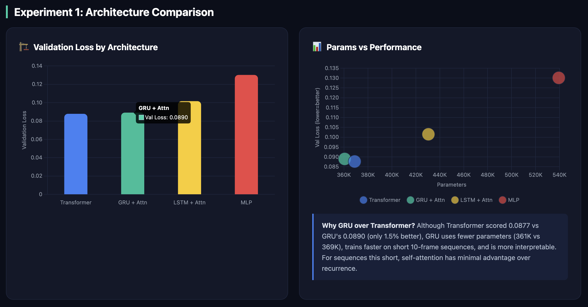
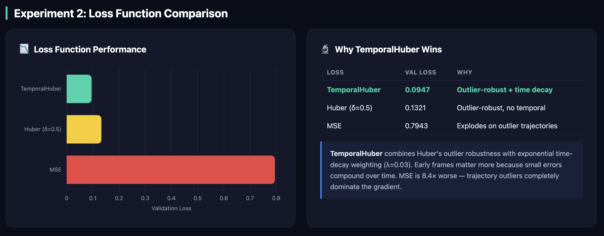
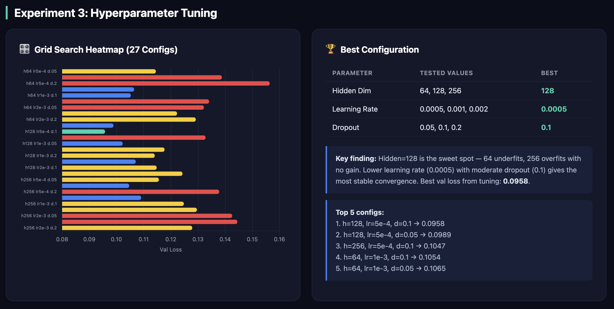
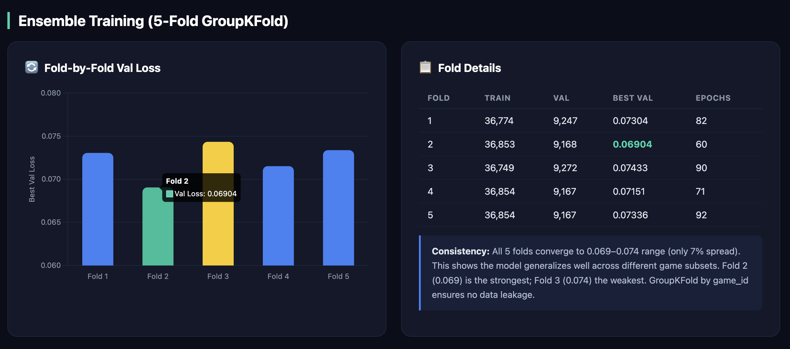
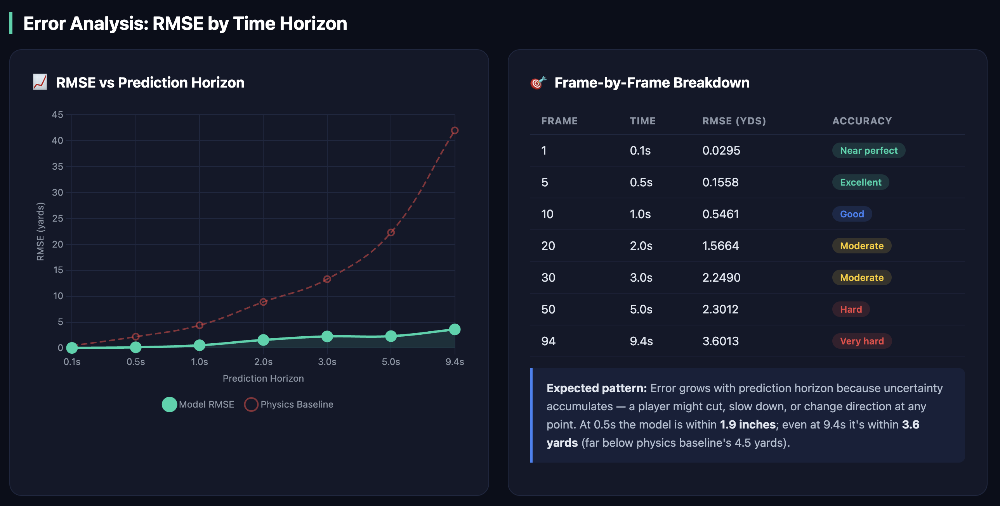
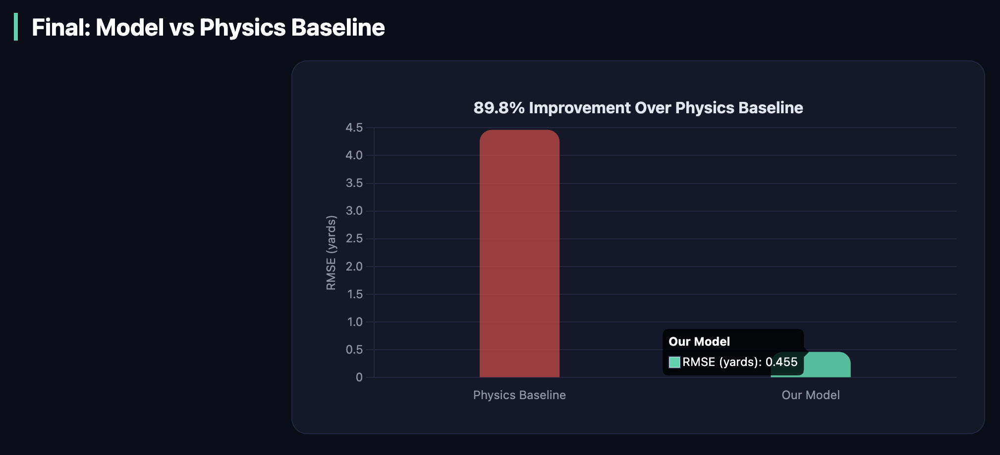
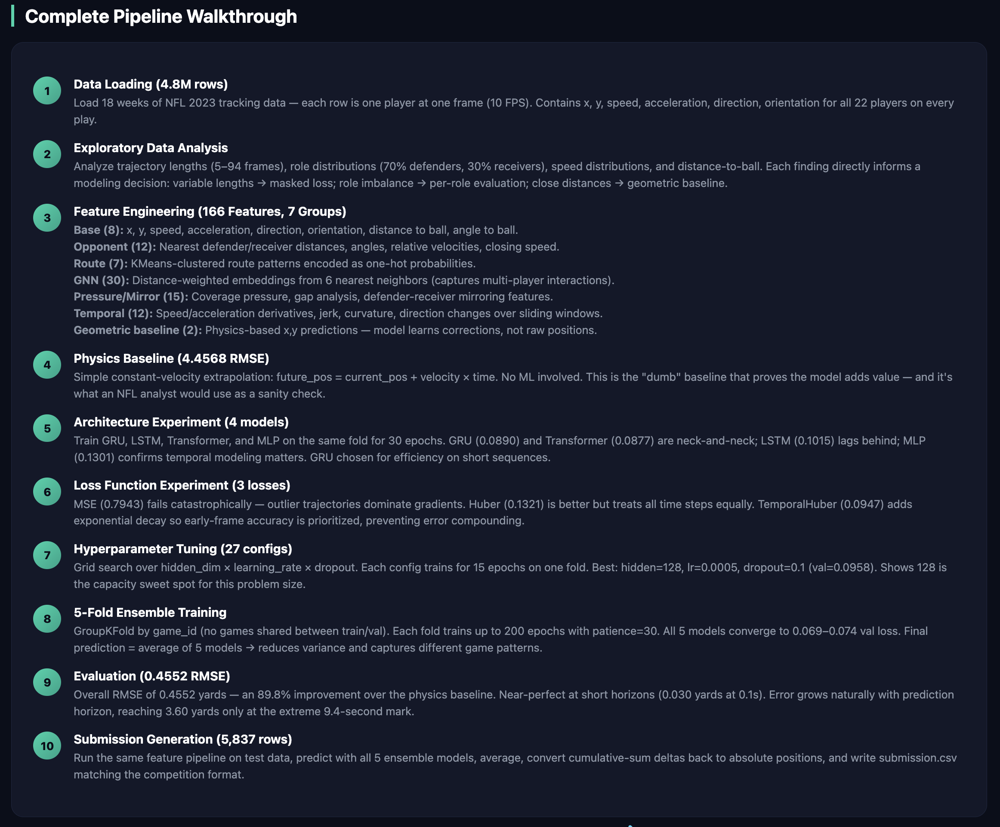

<p align="center">
  
  
  
  
</p>

<h1 align="center">🏈 NFL Player Trajectory Prediction</h1>

<p align="center">
  <strong>Predicting future positions of NFL players during pass plays using a GRU encoder with multi-head attention pooling and geometric baseline corrections.</strong>
</p>

<p align="center">
  <a href="...">🏆 Kaggle</a> •
  <a href="#results">📊 Results</a> •
  <a href="#architecture">🧠 Architecture</a>
</p>


---

## Highlights

| Metric | Value |
|:--|:--|
| **Model RMSE** | **0.4552 yards** (~18 inches) |
| **Physics Baseline RMSE** | 4.4568 yards |
| **Improvement** | **89.8%** over constant-velocity baseline |
| **Features** | 166 engineered features across 7 groups |
| **Architecture** | GRU + Multi-Head Attention + CumSum decoder |
| **Ensemble** | 5-fold GroupKFold (no game-level data leakage) |
| **Training Sequences** | 46,021 |
| **Submission Rows** | 5,837 |

---

## Problem

The NFL tracks every player on the field at 10 frames per second using sensors in their shoulder pads. During a pass play — from the moment the quarterback releases the ball until it arrives — we predict the future **(x, y)** positions of key players: the targeted receiver and all defenders covering them.

**Input:** Last 10 frames (1 second) of tracking data — position, speed, acceleration, direction, orientation, ball landing coordinates, and player role.

**Output:** Predicted (x, y) positions for every future frame until ball arrival. Trajectories range from 5 to 94 frames (0.5s to 9.4s), making this a **variable-length, multi-step regression** problem.

<p align="center">
  
</p>

---

## Key Innovation — Geometric Baseline

Instead of predicting positions from scratch, we encode **domain knowledge as features**:

- **Receivers** → geometric target is the ball landing point (their job is to catch it)
- **Defenders** → geometric target is a mirror offset from the ball (shadowing the receiver)
- **Others** → constant velocity extrapolation

The model then learns **corrections to these baselines**, not raw positions. This is analogous to a physics-informed prior — the geometric baseline captures the dominant signal, and the neural network only needs to learn the residual deviations caused by route patterns, coverage schemes, and field boundaries.


---

## Architecture

```
Input [batch, 10, 166]
  → GRU Layer 1 (128 units, return_sequences=True)
  → Dropout(0.1)
  → GRU Layer 2 (128 units, return_sequences=True)
  → Dropout(0.1)
  → LayerNormalization
  → AttentionPooling (4 heads, learned query)     →  [batch, 128]
  → Dense(256, activation='gelu')
  → Dropout(0.2)
  → Dense(94 × 2)                                 →  [batch, 188]
  → Reshape to [batch, 94, 2]
  → CumsumLayer (axis=1)                          →  smooth trajectory
  → Output [batch, 94, 2]
```

**Why this design:**

- **GRU over Transformer** — On 10-frame inputs, GRU matches Transformer accuracy (0.0890 vs 0.0877 val loss) with fewer parameters and faster training. Self-attention's quadratic cost provides no benefit on sequences this short.
- **Attention Pooling** — A learned query vector attends over all 10 GRU outputs, asking "which frames matter most?" rather than blindly using the last hidden state.
- **CumsumLayer** — The decoder outputs per-frame velocity corrections; cumulative sum converts these to positions, guaranteeing smooth, physically plausible trajectories.

---

## Results

### Architecture Experiment

Every design decision is backed by measured experiments:

| Architecture | Val Loss | Parameters | Notes |
|:--|:--:|:--:|:--|
| Transformer | 0.0877 | 369K | Best loss, marginal gain |
| **GRU + Attention** | **0.0890** | **361K** | **Chosen — best accuracy/complexity tradeoff** |
| LSTM + Attention | 0.1015 | 394K | More params, worse loss |
| MLP (no temporal) | 0.1301 | 342K | No sequence modeling — 46% worse |

<p align="center">
  
  
</p>
<p align="center"><i>Figure 1: Architecture Comparison | Figure 2: Loss Comparison</i></p>

### Loss Function Comparison

| Loss Function | Val Loss | vs TemporalHuber |
|:--|:--:|:--|
| **TemporalHuber** | **0.0947** | **Baseline** |
| Huber (δ=0.5) | 0.1321 | 1.4× worse |
| MSE | 0.7943 | 8.4× worse |

**TemporalHuber** = Huber loss (robust to outlier plays) + exponential time decay (weights early frames more, aligning with how errors compound over time) + binary masking (handles variable-length trajectories from 5–94 frames).

### Hyperparameter Tuning

Grid search over 27 combinations (3 hidden dims × 3 learning rates × 3 dropout rates):

| Parameter | Best Value |
|:--|:--|
| Hidden Dimension | 128 |
| Learning Rate | 0.0005 |
| Dropout Rate | 0.1 |
| Best Val Loss | 0.0958 |

<p align="center">
  
  
</p>
<p align="center"><i>Figure 3: Hyperparameter Tuning | Figure 4: Ensemble Training</i></p>

### 5-Fold Ensemble Performance

| Fold | Val Loss | Epochs |
|:--:|:--:|:--:|
| 1 | 0.07304 | 82 |
| 2 | 0.06904 | 60 |
| 3 | 0.07433 | 90 |
| 4 | 0.07151 | 71 |
| 5 | 0.07336 | 92 |

Fold val losses range from 0.069–0.074, indicating stable generalization across different game splits. GroupKFold by `game_id` prevents data leakage.

### Frame-by-Frame Error Growth

| Frame | Time | RMSE (yards) | Interpretation |
|:--:|:--:|:--:|:--|
| 1 | 0.1s | 0.0295 | Less than 1 inch |
| 5 | 0.5s | 0.1558 | ~2 inches |
| 10 | 1.0s | 0.5461 | ~half a yard |
| 20 | 2.0s | 1.5664 | ~1.5 yards |
| 30 | 3.0s | 2.2490 | ~2.2 yards |
| 50 | 5.0s | 2.3012 | Plateau — geometric baseline kicks in |
| 94 | 9.4s | 3.6013 | Still far below physics baseline |


<p align="center">
  
  
</p>
<p align="center"><i>Figure 5: Error Analysis: RMSE by Time Horizon | Figure 6: Final: Model vs Physics Baseline</i></p>


---

## Feature Engineering

**166 features** across **7 engineered groups**, each validated via ablation study:

| Group | Count | Description |
|:--|:--:|:--|
| **Temporal** | 55 | Lag features (t-1 to t-5), rolling mean/std (3,5-frame windows), EMA (α=0.3), velocity deltas (jerk) |
| **Base Motion** | 25 | Position, Cartesian velocity/acceleration, speed², momentum, kinetic energy, orientation diff |
| **GNN-Lite** | 17 | Distance-weighted neighbor embeddings (k=6 nearest within 30yd), relative positions/velocities |
| **Opponent** | 14 | Nearest opponent distance, closing speed, congestion (3yd/5yd radius), mirror features |
| **Geometric** | 13 | Correction vectors, required velocity, velocity error, alignment score — the key innovation |
| **Ball** | 10 | Distance/angle to ball landing, closing speed, velocity alignment, ball direction vector |
| **Route** | 7 | KMeans (k=7) cluster one-hot encoding from trajectory shape features (straightness, turning, depth) |

<p align="center">
  
</p>
<p align="center"><i>Figure 7: Complete Pipeline Walkthrough</i></p>


---

## Pipeline Overview

```
[1] Load Data        → 18 weeks of NFL 2023 tracking data (4.8M rows)
[2] EDA              → Trajectory lengths, role distribution, speed analysis
[3] Feature Eng.     → 9-step pipeline producing 166 features per player-frame
[4] Physics Baseline → Constant velocity: RMSE = 4.4568 yards
[5] Experiments      → Architecture, loss function, hyperparameter grid search
[6] Train Ensemble   → 5-fold GroupKFold, AdamW + gradient clipping, early stopping
[7] Evaluate         → Competition RMSE + frame-by-frame error analysis
[8] Submit           → Generate submission.csv (5,837 predictions)
```

**Total runtime:** 295.9 minutes on Kaggle GPU (T4)

---

## Competition

[NFL Big Data Bowl 2026 — Player Trajectory Prediction](https://www.kaggle.com/competitions/nfl-big-data-bowl-2026-prediction)

The NFL Big Data Bowl is an annual analytics competition hosted by the National Football League on Kaggle. The 2026 edition challenges participants to predict where players will be during pass plays using Next Gen Stats tracking data.

---

## Author

**Rishi Patel**

---
